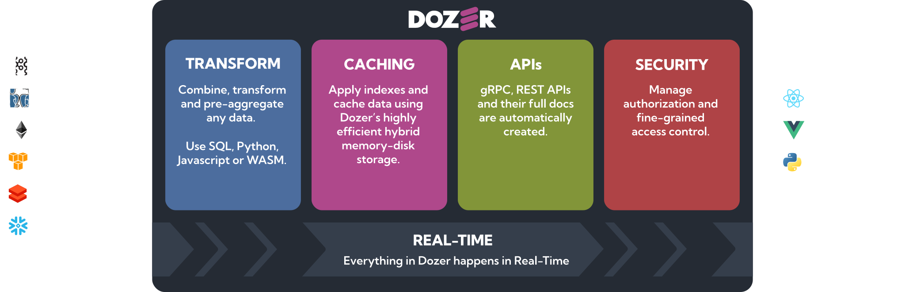

<div align="center">
    <a target="_blank" href="https://getdozer.io/">
        <br><br>
    </a>
</div>

<h4 align="center">
      ⚡️ Connect any data source, combine them in real-time and instantly get low-latency gRPC and REST APIs. All with just a simple configuration! ⚡️ 
</h4>

<p align="center">
  <a href="https://github.com/getdozer/dozer/actions/workflows/dozer.yaml" target="_blank"></a>
  <a href="https://coveralls.io/github/getdozer/dozer?branch=main" target="_blank"></a>
  <a href="https://getdozer.io/docs/dozer" target="_blank"></a>
  <a href="https://discord.com/invite/3eWXBgJaEQ" target="_blank"></a>
  <a href="https://github.com/getdozer/dozer/blob/main/LICENSE.txt" target="_blank"></a>

</p>
<br>

## Overview
Dozer implements a Real-Time SQL Engine that transforms and stores the data in an embedded cache powered by LMDB, automatically creates secondary indexes and instantly generates REST and gRPC APIs. Protobuf and Open API documentation are available out of the box. 

Dozer is implemented fully in Rust for fast processing of data and is less resource intensive. 

Dozer maintains the data in a caching layer built on LMDB (Lightning Memory-Mapped Database) so users can immediately and efficiently query data in the form of gRPC and REST APIs. Dozer publishes data contracts and API documentation out of the box for the best developer experience. 



Dozer takes an end-to-end approach, aiming to drastically lower the cost, complexity and effort involved in putting together the infrastructure necessary to build data applications. Today developers have to integrate and maintain a variety of tools to achieve the same result. 


Check out our website and sign up for [Early Access](https:///getdozer.io) to our hosted service.


## Quick Start
Refer to our [getting started](https://getdozer.io/docs/category/getting-started) and [examples section](https://getdozer.io/docs/category/what-can-you-build-with-dozer) for more details.
#### 1) End-to-end hypercharge postgres example
```bash
docker-compose -f examples/1_hypercharge_postgres/docker-compose.yml up
```
#### 2) Real time Ethereum stats example
Get a websocket url from one of the hosted eth node providers such as [Infura](https://www.infura.io/product/ethereum) and initialize the env variable `ETH_WSS_URL`.
```bash
# Intialize ETH Web Socker Url
export ETH_WSS_URL=<WSS_URL>

docker-compose -f examples/2_eth_stats_sample/docker-compose.yml up
```

## Running Dozer CLI
To view list of commands
```bash
docker run -it \
  public.ecr.aws/k7k6x1d4/dozer \
  dozer -h
```

Run dozer as a single process with a local `dozer-config.yaml`
```bash
# `dozer-config.yaml` should be in your current directory.
docker run -it \
  -v "$PWD":/usr/dozer \
  -p 8080:8080 \
  -p 50051:50051 \
  public.ecr.aws/k7k6x1d4/dozer \
  dozer
```

##  What can you do with Dozer

- Create **blazing fast** end to end APIs in minutes with a simple configuration.
- Build and rapidly iterate on customer facing data apps.
- Transform your data in real-time using standard SQL. 
- Cache your data and get search and filter functionality out of the box.
- Extend Dozer with **custom connectors, operators and Api transformations** using **WASM**.
- Built with **Rust** with performance and extensibility in mind.
- OpenAPI documentation and protobuf-based data contracts are auto-generated.


Read more about [Dozer here](https://getdozer.io/docs/dozer)

Detailed [Architecture can be found here](https:///getdozer.io/docs/dozer/architecture). 

## Features

**Plug & Play**

Dozer instantly generates fully indexed gRPC and REST APIs automatically. All you need is to configure a YAML file with your data source configuration and the APIs you want to deploy. As simple as that. There is no need to write any additional code saving several developer hours. Dozer is very much customizable. You can refer to your [Contributing](https://getdozer.io/docs/contributing/overview) section for more information on building more connectors as well as transformations. 


**Connect to all sources**

Dozer doesn't make a distinction between types of data sources. Developers can get a seamless experience building products with application databases such as Postgres and MySQL, data warehouses such as SnowFlake and cloud storage such as S3 and Deltalake. Dozer can also consume real-time events and Ethereum data. 

**Combine data from multiple sources**

Dozer can in real-time join data coming from multiple data sources powering advanced use cases such as customer personalization, real-time analytics etc. This can be done using the standard JOIN operator in SQL.

**APIs & Real-time queries**

At the heart of the implementation, Dozer has a streaming data pipeline that works on CDC across all stores. As new data flows in, Dozer incrementally computes aggregations and joins, and offers a far superior query experience than a traditional database for these scenarios. 

Data is stored in a cache built on LMDB (Lightning Memory-Mapped Database) and secondary indexes for single columns are automatically built. This gives users instant queryable APIs with operations such as filter, sort, and order_by functionality. 

**Scaling**

Dozer can be run as a single process for simple applications or can be run in a distributed fashion where writing and reading are de-coupled. This is a cost-effective approach where reading has a very low overhead and can be scaled on demand.


**Authorization**

Dozer offers authorization functionality through JWT tokens. Refer to [API Security](https://getdozer.io/docs/reference/api/security) for more details.

## Comparision
Dozer takes an opinionated and horizontal approach that cuts across different categories. In Dozer, you would find modules and functionalities comparable to streaming databases, caches, search engines and API generation tools.

You can find comparision [documented here](https://getdozer.io/docs/dozer/comparision)


## Releases
We release Dozer typically every 2 weeks and is available on our [releases page](https://github.com/getdozer/dozer/releases/latest). Currently, we publish a binary for Ubuntu 20.04 and also as a docker container.


Please visit our [issues section](https://github.com/getdozer/dozer/issues) if you are having any trouble running the project.


<br>

## Contributing
Please refer to [Contributing](https://getdozer.io/docs/contributing/overview) for more details.
