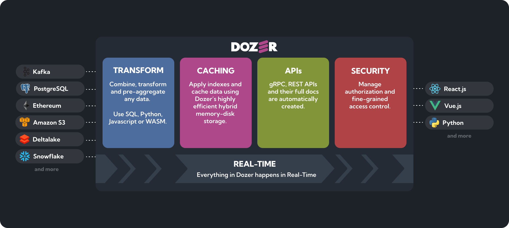
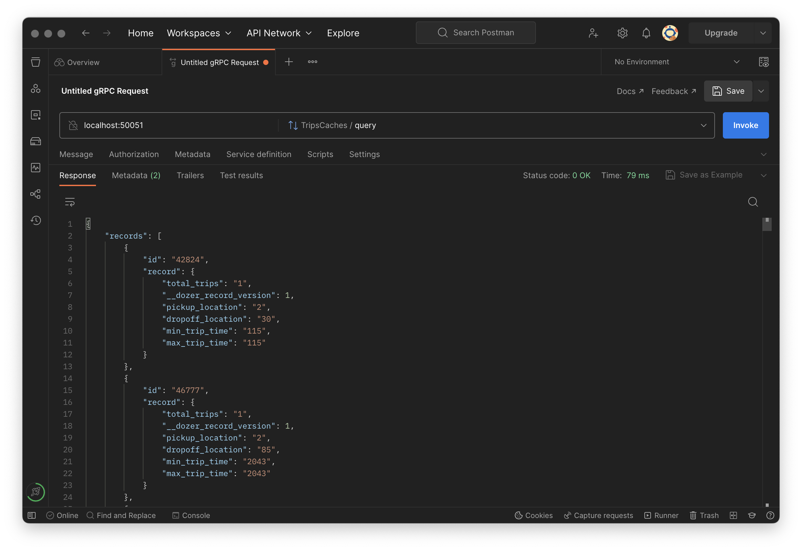

<div align="center">
    <a target="_blank" href="https://getdozer.io/">
        <br><br>
    </a>
</div>
<p align="center">
    <br />
    <b>
    Connect any data source, combine them in real-time and instantly get low-latency data APIs.<br>
    ⚡ All with just a simple configuration! ⚡️
    </b>
</p>

<br />

<p align="center">
  <a href="https://github.com/getdozer/dozer/actions/workflows/dozer.yaml" target="_blank"></a>
  <a href="https://coveralls.io/github/getdozer/dozer?branch=main" target="_blank"></a>
  <a href="https://getdozer.io/docs/dozer" target="_blank"></a>
  <a href="https://discord.com/invite/3eWXBgJaEQ" target="_blank"></a>
  <a href="https://github.com/getdozer/dozer/blob/main/LICENSE.txt" target="_blank"></a>
</p>

## Overview

Dozer makes it easy to build low-latency data APIs (gRPC and REST) from any data source. Data is transformed on the fly using Dozer's reactive SQL engine  and stored in a high-performance cache to offer the best possible experience. Dozer is useful for quickly building data products.



## Quick Start

Follow the instruction below to install Dozer on your machine and run a quick sample using the [NY Taxi Dataset](https://www.nyc.gov/site/tlc/about/tlc-trip-record-data.page)

### Installation

**MacOS Monterey (12) and above**

```bash
brew tap getdozer/dozer && brew install dozer
```

**Ubuntu 20.04 and above**

```bash
# amd64
curl -sLO https://github.com/getdozer/dozer/releases/latest/download/dozer-linux-amd64.deb && sudo dpkg -i dozer-linux-amd64.deb

# aarch64
curl -sLO https://github.com/getdozer/dozer/releases/latest/download/dozer-linux-aarch64.deb && sudo dpkg -i dozer-linux-aarch64.deb
```

Dozer requires `protobuf-compiler`, installation instructions can be found in [additional steps](https://getdozer.io/docs/installation/#additional-steps-for-protobuf-compiler-dependency)

**Build from source**

```bash
cargo install --path dozer-cli --locked
```

### Run it

**Download sample configuration and data**

Create a new empty directory and run the commands below. This will download a [sample configuration file](https://github.com/getdozer/dozer-samples/blob/main/connectors/local-storage/dozer-config.yaml) and a sample [NY Taxi Dataset file](https://www.nyc.gov/site/tlc/about/tlc-trip-record-data.page).

```bash
curl -o dozer-config.yaml https://raw.githubusercontent.com/getdozer/dozer-samples/main/connectors/local-storage/dozer-config.yaml
curl --create-dirs -o data/trips/fhvhv_tripdata_2022-01.parquet https://d37ci6vzurychx.cloudfront.net/trip-data/fhvhv_tripdata_2022-01.parquet
```

**Run Dozer binary**

```bash
dozer -c dozer-config.yaml
```

Dozer will start processing the data and populating the cache. You can see a progress of the execution from the console.

**Query the APIs**

When some data is loaded, you can query the cache using gRPC or REST

```bash
# gRPC
grpcurl -d '{"query": "{\"$limit\": 1}"}' -plaintext localhost:50051 dozer.generated.trips_cache.TripsCaches/query

# REST
curl -X POST  http://localhost:8080/trips/query --header 'Content-Type: application/json' --data-raw '{"$limit":3}'
```

Alternatively, you can use [Postman](https://www.postman.com/) to discover gRPC endpoints through gRPC reflection



Read more about Dozer [here](https://getdozer.io/docs/dozer). And remember to star 🌟 our repo to support us!

## Client Libraries

| Library                                                  | Language                                              | License |
| -------------------------------------------------------- | ----------------------------------------------------- | ------- |
| [dozer-python](https://github.com/getdozer/dozer-python) | Dozer Client library for Python                       | Apache-2.0     |
| [dozer-js](https://github.com/getdozer/dozer-js)         | Dozer Client library for Javascript                   | Apache-2.0     |
| [dozer-react](https://github.com/getdozer/dozer-react)   | Dozer Client library for React with easy to use hooks | Apache-2.0     |

<br>

[**Python**](https://github.com/getdozer/dozer-python)

```python
from pydozer.api import ApiClient
api_client = ApiClient('trips')
api_client.query()
```

[**Javascript**](https://github.com/getdozer/dozer-js)

```js
import { ApiClient } from "@dozerjs/dozer";

const flightsClient = new ApiClient('flights');
flightsClient.count().then(count => {
    console.log(count);
});
```

[**React**](https://github.com/getdozer/dozer-react)

```js
import { useCount } from "@dozerjs/dozer-react";
const AirportComponent = () => {
    const [count] = useCount('trips');
    <div> Trips: {count} </div>
}
```

## Samples

Check out Dozer's [samples repository](https://github.com/getdozer/dozer-samples) for more comprehensive examples and use case scenarios.

| Type             | Sample                                                                                                                     | Notes                                                                        |
| ---------------- | -------------------------------------------------------------------------------------------------------------------------- | ---------------------------------------------------------------------------- |
| Connectors       | [Postgres](https://github.com/getdozer/dozer-samples/tree/main/connectors/postgres)                                        | Load data using Postgres CDC                                                 |
|                  | [Local Storage](https://github.com/getdozer/dozer-samples/tree/main/connectors/local-storage)                              | Load data from local files                                                   |
|                  | Snowflake (Coming soon)                                                                                                    | Load data using Snowflake table streams                                      |
| SQL              | [Using JOINs](https://github.com/getdozer/dozer-samples/tree/main/sql/join)                                                | Dozer APIs over multiple sources using JOIN                                  |
|                  | [Using Aggregations](https://github.com/getdozer/dozer-samples/tree/main/sql/aggregations)                                 | How to aggregate using Dozer                                                 |
|                  | [Using Window Functions](https://github.com/getdozer/dozer-samples/tree/main/sql/window-functions)                         | Use `Hop` and `Tumble` Windows                                               |
| Use Cases        | [Flight Microservices](https://github.com/getdozer/dozer-samples/tree/main/usecases/pg-flights)                            | Build APIs over multiple microservices.                                      |
|                  | Use Dozer to Instrument (Coming soon)                                                                                      | Combine Log data to get real time insights                                   |
|                  | Real Time Model Scoring (Coming soon)                                                                                      | Deploy trained models to get real time insights as APIs                      |
| Client Libraries | [Dozer React Starter](https://github.com/getdozer/dozer-samples/tree/main/usecases/react)                                                                                          | Instantly start building real time views using Dozer and React               |
|                  | [Ingest Polars/Pandas Dataframes](https://github.com/getdozer/dozer-samples/tree/main/client-samples/ingest-python-sample) | Instantly ingest Polars/Pandas dataframes using Arrow format and deploy APIs |
| Authorization    | Dozer Authorziation (Coming soon)                                                                                          | How to apply JWT Auth on Dozer                                               |

## Connectors

Refer to the full list of connectors and example configurations [here](https://getdozer.io/docs/configuration/connectors).

| Connector                                                   |   Status    | Type           |  Schema Mapping   | Frequency | Implemented Via |
| :---------------------------------------------------------- | :---------: | :------------- | :---------------: | :-------- | :-------------- |
| Postgres                                       | Available ✅ | Relational     |      Source       | Real Time | Direct          |
| Snowflake                                     | Available ✅ | Data Warehouse |      Source       | Polling   | Direct          |
| Local Files (CSV, Parquet)                  | Available ✅ | Object Storage |      Source       | Polling   | Data Fusion     |
| Delta Lake                                    |    Alpha    | Data Warehouse |      Source       | Polling   | Direct          |
| AWS S3 (CSV, Parquet)                            |    Alpha    | Object Storage |      Source       | Polling   | Data Fusion     |
| Google Cloud Storage(CSV, Parquet) |    Alpha    | Object Storage |      Source       | Polling   | Data Fusion     |
| Ethereum                                       | Available ✅ | Blockchain     | Logs/Contract ABI | Real Time | Direct          |
| Kafka Stream                                                      | Available ✅  |          |  Schema Registry  | Real Time | Debezium        |
| MySQL                                                       | In Roadmap  | Relational     |      Source       | Real Time | Debezium        |
| Google Sheets                                               | In Roadmap  | Applications   |      Source       |           |                 |
| Excel                                                       | In Roadmap  | Applications   |      Source       |           |                 |
| Airtable                                                    | In Roadmap  | Applications   |      Source       |           |                 |

## Pipeline Log Reader Bindings

| Library                                                  | Language                                              | License |
| -------------------------------------------------------- | ----------------------------------------------------- | ------- |
| [dozer-log-python](./dozer-log-python) | Python binding for reading Dozer logs                       | Apache-2.0     |
| [dozer-log-js](./dozer-log-js)         | Node.js binding for reading Dozer logs                   | Apache-2.0     |

[**Python**](./dozer-log-python)
> Note: We support CPython >= 3.10 on Windows, MacOS and Linux, both amd and arm architectures.

```python
import pydozer_log

reader = await pydozer_log.LogReader.new('.dozer', 'trips')
print(await reader.next_op())
```

[**Javascript**](./dozer-log-js)

```javascript
const dozer_log = require('@dozerjs/log');

const runtime = dozer_log.Runtime();
reader = await runtime.create_reader('.dozer', 'trips');
console.log(await reader.next_op());
```

## Releases

We release Dozer typically every 2 weeks and is available on our [releases page](https://github.com/getdozer/dozer/releases/latest). Currently, we publish binaries for Ubuntu 20.04, Apple(Intel) and Apple(Silicon).

Please visit our [issues section](https://github.com/getdozer/dozer/issues) if you are having any trouble running the project.

## Contributing

Please refer to [Contributing](https://getdozer.io/docs/contributing/overview) for more details.
