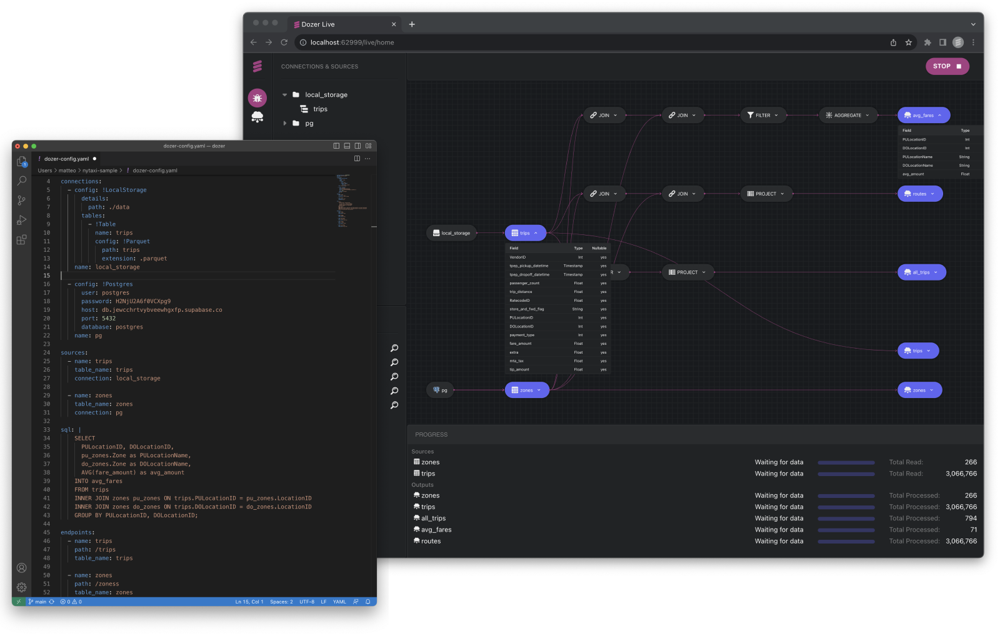
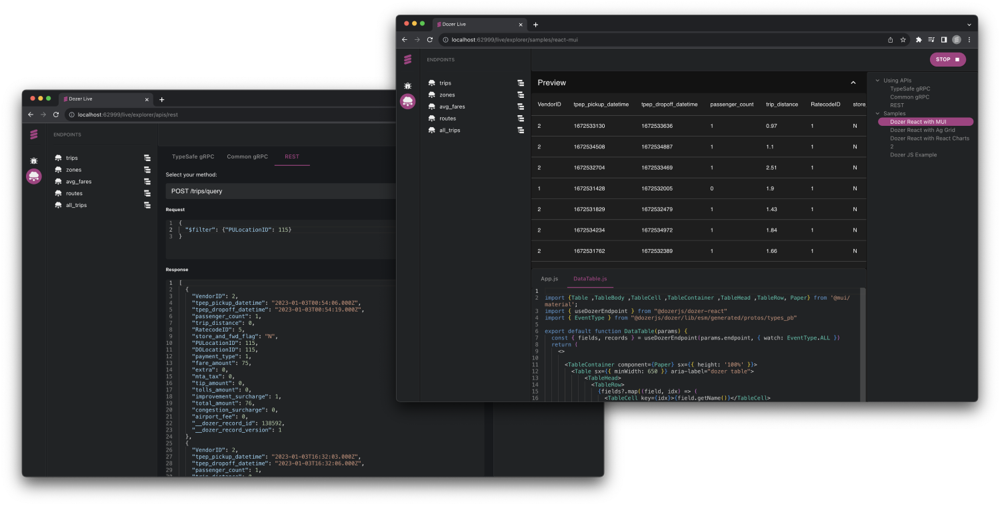
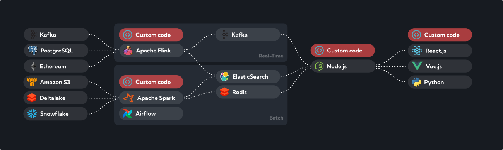

    <a target="_blank" href="https://getdozer.io/">
          
    </a>

  
  
  
  
  

## WARNING

This is the legacy branch where we have support for stateful SQL transformations and embedded cache. These features have been dropped in the latest version of Dozer. Please use the [main branch](https://github.com/getdozer/dozer).

## Overview

Dozer is a **data platform for building, deploying and maintaining real-time data products.**

It is ideal for companies with multiple databases, data warehouses and data lakes that are in need of combining, aggregating and transforming data in real time, and create customer facing or internal data applications. 

*Put it simply, Dozer empowers a single developer go from data sources to ready-made APIs in just a few minutes. All with just a with a simple configuration file.*

## How it works
Dozer pulls data from various sources like databases, data lakes, and data warehouses using Change Data Capture (CDC) and periodic polling mechanisms. This ensures up-to-date data ingestion in real-time or near-real-time.

After capturing data, Dozer offers the possibility of combining, transforming and aggregating it 
using its own internal real-time transformation engine. It supports Streaming SQL, WebAssembly (coming soon) and TypeScript (coming soon), as well as ONNX for performing AI predictions in real-time. 

After processing, data is stored and indexed in a low-latency datastore (based on [LMDB](https://github.com/LMDB/lmdb)), queryable using REST and gRPC.

## How to use it

### ① Build
A Dozer application consists of a YAML file that can be run locally using the Dozer Live UI or Dozer CLI. As YAML is edited,
changes are immediately reflected on Dozer Live UI. 

### ② Test
Dozer can run the entire infrastructure locally. You can inspect data flowing in in real time or use the built-it API explorer to query data through REST and gRPC. Dozer Live explorer also provides ready-made samples to integrate results into your front-end applications.

### ③ Deploy
Dozer applications can be self-hosted or deployed in the cloud with a single command. Dozer Cloud (coming soon) provides self-healing and monitoring capabilities, making sure your APIs are always available.

## Supported Sources and Tranformation Engines
Dozer currently supports a variety of source databases, data warehouses and object stores. Whenever possible, Dozer leverages Change Data Capture (CDC) to keep data always fresh. For sources that do not support CDC, periodic polling is used.

Dozer transformations can be executed using Dozer's highly cutomizable streaming SQL engine, which provides UDF supports in WASM (coming soon), TypeScript (coming soon) and ONNX.

Here is an overview of all supported source types and transformation engines:

## Why Dozer ?
As teams embark on the journey of implementing real-time data products, they invariably come across a host of challenges that can make the task seem daunting:

1. **Integration with Various Systems**: Integrating with various data sources can present numerous technical hurdles and interoperability issues.

2. **Managing Latency**: Ensuring low-latency data access, especially for customer-facing applications, can be a significant challenge.

3. **Real-Time Data Transformation**: Managing real-time data transformations, especially when dealing with complex queries or large volumes of data, can be difficult and resource-intensive. 

4. **Maintaining Data Freshness**: Keeping the data up-to-date in real-time, particularly when it's sourced from multiple locations like databases, data lakes, or warehouses, can be a daunting task.

4. **Scalability and High Availability**: Building a data application that can efficiently handle high-volume operations and remain reliable under heavy loads requires advanced architecture design and robust infrastructure.

To address all the above issues, teams often find themselves stitching together multiple technologies and a significant amount of custom code. This could involve integrating diverse systems like Kafka for real-time data streaming, Redis for low-latency data access and caching, and Spark or Flink for processing and analyzing streaming data.

The complexity of such a setup can become overwhelming. Ensuring that these different technologies communicate effectively, maintaining them, and handling potential failure points requires extensive effort and expertise.

This is where Dozer steps in, aiming to dramatically simplify this process. Dozer is designed as an all-in-one backend solution that integrates the capabilities of these disparate technologies into a single, streamlined tool. By doing so, Dozer offers the capacity to build an end-to-end real-time data product without the need to manage multiple technologies and extensive custom code.

Dozer's goal is to empower a single engineer or a small team of engineers to fully manage the entire lifecycle of a Data Product!

## Getting Started

Follow the links below to get started with Dozer:

- [Installation](https://getdozer.io/docs/installation)
- [Build a sample application using NY Taxi dataset](https://getdozer.io/docs/getting_started)

For a more comprehensive list of samples check out our [GitHub Samples repo](https://github.com/getdozer/dozer-samples)
