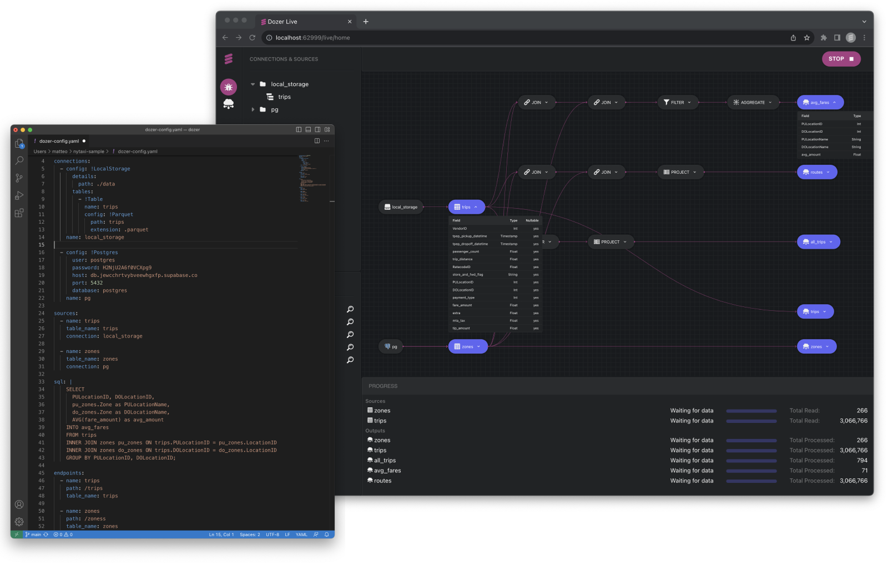

    <a target="_blank" href="https://getdozer.io/">
          
    </a>

  
  
  
  
  

## Overview

Dozer is a data **real-time platform to build, deploy and mantain data products.**

It pulls data in real-time from various sources like databases, data lakes, and warehouses using Change Data Capture (CDC) and periodic polling mechanisms. This ensures up-to-date data ingestion in real-time or near-real-time.

Dozer features an internal streaming engine capable of executing transformations and aggregations in real-time. It supports Streaming SQL, WebAssembly (coming soon) and TypeScript (coming soon), as well as ONNX for performing predictions in real-time. 

After ingestion and transformation, data is stored in a low-latency datastore (based on [LMDB](https://github.com/LMDB/lmdb)), queryable using REST and gRPC.

A Dozer application is entirely configured using a YAML file and can be tested locally using the Dozer Live UI.

Following the local development and testing, Dozer Applications can be deployed in a self-hosted way or using Dozer Cloud (coming soon).

## Supported Sources and Tranformation Engines
Dozer currently supports multiple databases, data warehouses and object store as a source. Whenever possible, Dozer leverages real-time streaming to keep data fresh. 

Dozer transformations can be executed using Dozer's highly cutomizable streaming SQL engine, which provides UDF supports in WASM (coming soon), TypeScript (coming soon) and ONNX.

## Why Dozer ?
As teams embark on the journey of implementing real-time data products, they invariably come across a host of challenges that can make the task seem daunting:

1. **Integration with Various Systems**: Integrating with various data sources can present numerous technical hurdles and interoperability issues.

2. **Managing Latency**: Ensuring low-latency data access, especially for customer-facing applications, can be a significant challenge.

3. **Real-Time Data Transformation**: Managing real-time data transformations, especially when dealing with complex queries or large volumes of data, can be difficult and resource-intensive. 

4. **Maintaining Data Freshness**: Keeping the data up-to-date in real-time, particularly when it's sourced from multiple locations like databases, data lakes, or warehouses, can be a daunting task.

4. **Scalability and High Availability**: Building a data application that can efficiently handle high-volume operations and remain reliable under heavy loads requires advanced architecture design and robust infrastructure.

To address all the above issues, teams often find themselves stitching together multiple technologies and a significant amount of custom code. This could involve integrating diverse systems like Kafka for real-time data streaming, Redis for low-latency data access and caching, and Spark or Flink for processing and analyzing streaming data.

The complexity of such a setup can become overwhelming. Ensuring that these different technologies communicate effectively, maintaining them, and handling potential failure points requires extensive effort and expertise.

This is where Dozer steps in, aiming to dramatically simplify this process. Dozer is designed as an all-in-one backend solution that integrates the capabilities of these disparate technologies into a single, streamlined tool. By doing so, Dozer offers the capacity to build an end-to-end real-time data product without the need to manage multiple technologies and extensive custom code.

## Getting Started

Follow the links below to install Dozer and get started:

- [Installation](https://getdozer.io/docs/installation)
- [Get Started](https://getdozer.io/docs/getting_started) using NY Taxi Dataset 