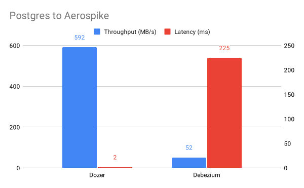

<div align="center">
    <a target="_blank" href="https://getdozer.io/">
        <br><br>
    </a>
</div>

<p align="center">
  <a href="https://github.com/getdozer/dozer/actions/workflows/dozer.yaml" target="_blank"></a>
  <a href="https://coveralls.io/github/getdozer/dozer?branch=main" target="_blank"></a>
  <a href="https://getdozer.io/docs/dozer" target="_blank"></a>
  <a href="https://discord.com/invite/3eWXBgJaEQ" target="_blank"></a>
  <a href="https://github.com/getdozer/dozer/blob/main/LICENSE.txt" target="_blank"></a>
</p>

# Overview

Dozer is a high-throughput, low-latency data movement tool that saves you days or even weeks to build ETL pipelines.

Compared with Debezium + Kafka + custom code to move data from Postgres to Aerospike:



# Quick Start

## Installation

### MacOS (Monterey 12 and above)

```bash
brew tap getdozer/dozer
brew install dozer
```

### Ubuntu (20.04 and above)

```bash
export ARCH=amd64 # Change to arm64 for ARM CPUs
curl -sLO https://github.com/getdozer/dozer/releases/latest/download/dozer-linux-${ARCH}.deb
sudo dpkg -i dozer-linux-${ARCH}.deb
```

## Usage

Dozer runs with a single configuration file like the following:

```yaml
app_name: dozer-bench
version: 1
connections:
  - name: pgbench
    config: !Postgres
      user: user
      password: postgres
      host: localhost
      port: 5432
      database: bench

endpoints:
  - table_name: pgbench_accounts
    kind: !Aerospike
      namespace: test
      hosts: localhost
      set_name: test
```

Any string can be used for `app_name`. Any integer can be used for `version`. `connections.config` is a [YAML tag](https://yaml.org/spec/1.2/spec.html#id2761292) that specifies the type of the connection. See all supported [connectors](#connectors) below. `endpoints.kind` is a YAML tag that specifies the type of the sink. See all supported [sinks](#sinks) below.

This configuration file specifies how to connect to a Postgres database, and moves the data in the `pgbench_accounts` table to an Aerospike database.

Save this file as `dozer-config.yaml` and run the following command:

```bash
dozer run -c dozer-config.yaml
```

You will immediately see the data flowing from Postgres to Aerospike. As you make changes to the Postgres table, Dozer will automatically pick up the changes and apply them to Aerospike!

# Connectors

| Connector            | Extraction | Resuming | Schema Evolution |
|----------------------|------------|----------|------------------|
| Postgres             | ✅          | ✅        | ✅                |
| MySQL                | ✅          | ✅        | ✅                |
| Snowflake            | ✅          | ✅        | 🎯               |
| Kafka                | ✅          | 🚧       | 🎯               |
| MongoDB              | ✅          | 🎯       | 🎯               |
| Amazon S3            | ✅          | 🎯       | 🎯               |
| Google Cloud Storage | ✅          | 🎯       | 🎯               |

✅: Supported, 🚧: In progress, 🎯: Planned

# Sinks

| Sink       | Loading | Resuming |
|------------|---------|----------|
| Aerospike  | ✅       | 🚧       |
| BigQuery   | ✅       | 🎯       |
| SQLite     | 🚧      | 🎯       |
| Snowflake  | 🚧      | 🎯       |
| ClickHouse | 🚧      | 🎯       |

✅: Supported, 🚧: In progress, 🎯: Planned

# Transformations

We currently support selections, projections, TTL, window operations (hop, tumble) and UDFs. UDFs can be implemented via JavaScript or ONNX model.
