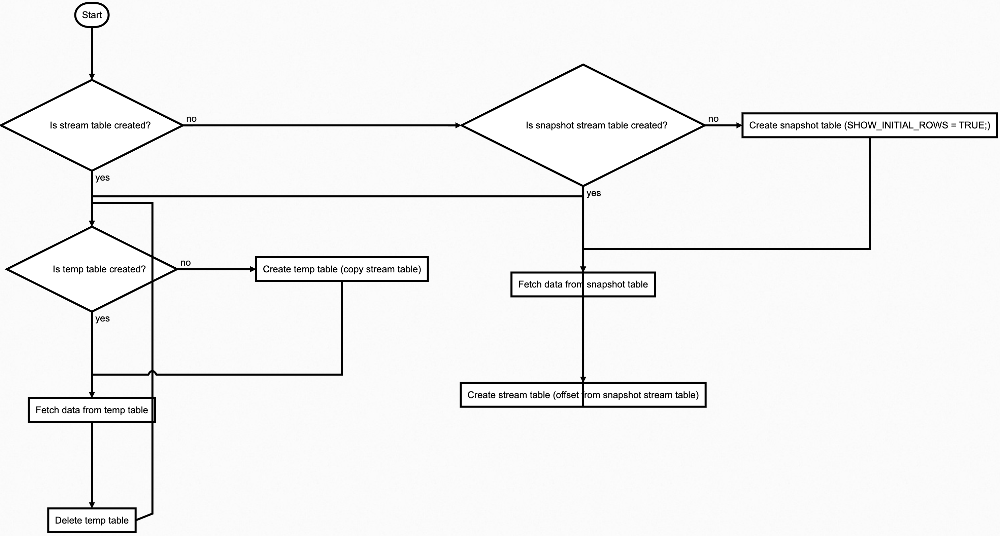

# Snowflake

## Prerequisites
This module allows developer to connect snowflake database via ODBC protocol.
This connector requires the installation of odbc and snowflake odbc driver.


## Installation guide
https://docs.snowflake.com/en/user-guide/odbc.html

## Benchmarking / Testing

For benchmarking and testing we use customer table from snowflakes samples TPCH_SF10 database.
Datasets can be found in https://docs.snowflake.com/en/user-guide/sample-data.html

```sql
DROP TABLE CUSTOMER;

CREATE TABLE CUSTOMER LIKE SNOWFLAKE_SAMPLE_DATA.TPCH_SF10.CUSTOMER;

INSERT INTO CUSTOMER SELECT * FROM "SNOWFLAKE_SAMPLE_DATA"."TPCH_SF10"."CUSTOMER";
```

## Flow of data


```
st=>start: Start
cond=>condition: Is stream table created?
    cond_snapshot=>condition: Is snapshot stream table created?
    create_snapshot_table=>operation: Create snapshot table (SHOW_INITIAL_ROWS = TRUE;)
fetch_data=>operation: Fetch data from snapshot table
create_stream=>operation: Create stream table (offset from snapshot stream table)
consume_stream=>operation: Fetch data from stream table
temp_table_condition=>condition: Is temp table created?
    create_temp_table=>operation: Create temp table (copy everything from stream table)
fetch_temp_data=>operation: Fetch data from temp table
delete_temp_table=>operation: Delete temp table

st->cond
cond(yes)->temp_table_condition
cond(no)->cond_snapshot
cond_snapshot(yes)->fetch_data->create_stream->temp_table_condition
cond_snapshot(no)->create_snapshot_table->fetch_data->create_stream->temp_table_condition
temp_table_condition(no)->create_temp_table->fetch_temp_data
temp_table_condition(yes)->fetch_temp_data->delete_temp_table->temp_table_condition
```

### Additional commands for M1 processor
```
export LDFLAGS="-L/opt/homebrew/Cellar/unixodbc/2.3.11/lib"
export CPPFLAGS="-I/opt/homebrew/Cellar/unixodbc/2.3.11/include"

export LIBRARY_PATH=$LIBRARY_PATH:$(brew --prefix)/lib:$(brew --prefix)/opt/odbc/lib
```
